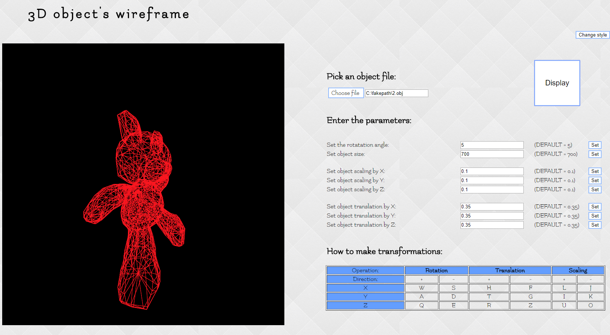

# 3D object's wireframe
</br>
 You can test it at this [link](https://anzemur.github.io/3D-object-s-wireframe/)
</br>
JS program that projects a 3D object on 2D canvas without using WebGL and glMatrix transformation functions. User can transform the 3D object on all axes (X, Y and Z) and do the TRS(translate, rotate, scale) transformations on the object.

## How to use:

  Pick your .obj file and upload it and then you can do all the transformations using keyboard.

</br>

## .obj file:

  Object file must be formed like this:

  ```
  v x1 y1 z1
  v x2 y2 z2
  v x3 y3 z3
  ...

  f v1 v2 v3
  f v3 v4 v5
  f v2 v4 v5
  ...
  ```
  Where v represents the coordinates of angles and f links between them.


</br>

## More .obj files:

You can get more object files at this [link](https://groups.csail.mit.edu/graphics/classes/6.837/F03/models/).

</br>
</br>

## Screenshot:

</br>


